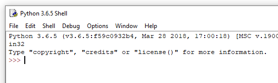

intruksione për Python
======================

Python është një gjuhë programimi shumë e njohur për qëllime të përgjithshme. U bë e njohur për thjeshtësinë, lehtësinë e mësimit dhe programimin e shpejtë. Shumë zhvillues profesionistë e përdorin Python të paktën si një gjuhë ndihmëse, sepse ata shpejt dhe me lehtësi automatizojnë punë të ndryshme me të. Për shkak të cilësive të lartpërmendura, ka gjithnjë e më shumë përdorues të Python midis njerëzve nga profesionet e tjera që përdorin programim në fusha të ndryshme. Gjuha e programimit Python është e lirë për t'u përdorur, dhe një komunitet i madh është formuar rreth tij, duke kontribuar në zhvillimin e saj të mëtejshëm dhe mbështetjen e përgjithshme në internet.

Gjuha e programimit të Python bën të qartë se programimi nuk është vetëm për programuesit profesionistë, në të njëjtën mënyrë si shkrimi nuk është vetëm për shkrimtarët profesionistë. Ka gjithnjë e më shumë punë të ndryshme që mund të bëhen disi më të lehta, më të suksesshme ose më produktive me aftësi të moderuar të programimit. Prandaj, ky manual nuk është vetëm për profesionistët e ardhshëm të programimit, por për secilin që mund të përfitojë nga programimi në punët e tyre (ose gjetkë).

Pra, le të shohim bazat e Python dhe të shohim se si shkruhen komandat dhe programet në këtë gjuhë programimi.

Interpetuesi Python
--------------------

Për të ekzekutuar programet që shkruajmë në Python, na duhet një program i quajtur interpretues Python. Ky program interpreton dhe pastaj ekzekuton komandat e Python. Interpretuesit e Python mund të pranojnë programe të tëra dhe t'i ekzekutojnë ato, dhe ata gjithashtu mund të punojnë në mënyrë **interaktive**, në të cilën çdo komandë që hyjmë ekzekutohet menjëherë.

Mjedisi në të cilin interpretuesi Python ekzekuton quhet shell. Ekzistojnë predha të ndryshme në të cilat interpretuesi përkatës i Python mund të ekzekutohet. Prandaj, ne kemi disa mënyra për të hedhur në treg shell-in e Python.

 **Shells online**

Website https://www.python.org/shell përmban një online shell, të cilat mund t’i përdorni menjëherë për punë interaktive (mjafton të keni akses në internet).

.. image:: ../../_images/Console/console_shell_online.png
   :width: 550px   
   :align: center 

**Instalimi i Python and mjedisi IDLE**

To learn Python programming, it is certainly useful to download Python from https://www.python.org/downloads/ and install it if it is not already installed on your computer. Me instalimin e Python, ju gjithashtu merrni një program të quajtur *IDLE* (mjedis i integruar i zhvillimit dhe mësimit). Ky mjedis i integruar përfshin gjithashtu një shell ku mund të ekzekutoni programet e Python. Kur ekzekutoni *IDLE* në kompjuterin tuaj, ju merrni dritaren e mëposhtme, në të cilën mund të punoni në mënyrë interaktive dhe të shkruani dhe ekzekutoni programet Python.

**Shell në Windows**

Një mënyrë tjetër për të filluar një shell Python është të hapni një dritare komande (në sistemet *Windows* kjo bëhet duke ekzekutuar programin *cmd*) dhe më pas shtypni *Python* në dritaren e komandës (këtu supozojmë se Python është i instaluar në mënyrë që është i arritshëm nga çdo dosje, përndryshe duhet së pari të pozicionoheni në dosjen e interpretuesve Python).

.. image:: ../../_images/Console/console_shell_cmdwindow.png
   :width: 550px   
   :align: center 

Ju mund të zgjidhni çdo shell që ju pëlqen, ato janë përdorur të gjitha në të njëjtën mënyrë.

Puna interaktive
-----------------

Hapni shellin Python. Karakteri ``>>>`` përfaqëson prompt. Në këtë mënyrë interpretuesi i Python na tregon se është gati të marrë komandën.

Kur punoni në mënyrë interaktive, përkthyesi Python mund të përdoret gjithashtu si kalkulator - shkruani një shprehje dhe merrni vlerën e saj:

.. code::

    >>> 3 + 2
    5
    >>> 3.25 + 2.25
    5.5
    >>> 3 - 2
    1
    >>> 4 * 2
    8
    >>> 4 / 2
    2.0
    
Simbolet e mëposhtme përdoren për operacionet bazë të llogaritjes në Python (si në shumicën e gjuhëve programuese):

- mbledhje: ``+``
- zbritje: ``-``
- shumëzim: ``*``
- zbritje: ``/``

Përveç këtyre themelore dhe ato që përdoren më shpesh, ndonjëherë na duhen disa operacione të tjera, të cilat përdoren më rrallë. Ato janë të:

- pjesëtimi i numrit të plotë (duke marrë të gjithë pjesën e herës): ``//``, për shembull vlera e shprehjes :math: `7 // 2` është :math: `3`.
- pjesa tjetër e një ndarjeje: ``%``, për shembull vlera e shprehjes :math: `7 \% 2` është :math: `1`.
- operatori i shumëzimit: ``**``, për shembull vlera e shprehjes :math: `2 ** 4` është :math:`2^4 = 16`.

.. code::

    >>> 7 // 2
    3
    >>> 7 % 2
    1
    >>> 2 ** 4
    16

Kompjuterët bëjnë dallimin midis numrave të plotë dhe numrave realë, i shkruajnë ato ndryshe në kujtesën e tyre dhe bëjnë llogaritje me ta në mënyra të ndryshme. Pra, në programim, vlera 2.0 nuk është plotësisht e njëjtë me 2, megjithëse vlerat janë matematikisht të barabarta (shenja `` == `` përdoret për të krahasuar dy vlerat).

.. code::

    >>> 2.0 == 2
    True
    >>> type(2.0)
    <class 'float'>
    >>> type(2)
    <class 'int'>

Ajo që ne shohim do të thotë se numri i parë është i vërtetë dhe i dyti është numër i plotë (fjala *float* tregon numra realë, dhe *int* shënon numër të plotë).

Në lidhje me këtë, vini re se në Python, rezultati i ndarjes së zakonshme ``/`` është gjithmonë një numër i vërtetë, edhe kur operanët janë numër i plotë dhe janë të ndashëm (nuk ka asnjë të mbetur). Kur duam që rezultati i ndarjes midis dy numrave të plotë të jetë një numër i plotë, duhet të përdorim operatorin e ndarjes me numër të plotë ``//``.

.. code::

    >>> 6/2
    3.0
    >>> 6//2
    3
    
.. commented out

    Using Python's built-in functions, we can convert a real number to an integer, and an integer to a real number.

    .. code::

        >>> float(3)
        3.0
        >>> int(3.0)
        3
        >>> int(6/2)
        3

Për operacionet e tjera të përcaktuara, rezultati është një numër i plotë kur të dy operandët (numrat për të cilët aplikohet operacioni) janë numër i plotë, dhe i vërtetë nëse të paktën një operand është real.

.. code::

    >>> 3 + 2
    5
    >>> 3.0 + 2
    5.0
    >>> 3 + 2.0
    5.0
    >>> 2.0 ** 4
    16.0

Rregullat për llogaritjen e vlerave të shprehjes janë të njëjta si në matematikë:

- Fuqia llogaritet para operacioneve të tjera. Nëse ka operacione të fuqisë së sekuencave të shumta, ato kryhen nga e djathta në të majtë.
- Operacionet e shumëzimit, ndarjes dhe pjesës së mbetur aplikohen para shtimit dhe zbritjes. Kur ka më shumë rresht, ato ekzekutohen nga e majta në të djathtë.
- Kur kemi nevojë për një renditje të ndryshme të llogaritjes, përdorim kllapa (pjesa në kllapa është llogaritur e para).

.. code::

    >>> (5-3) * (2+2)
    8
    >>> 

Mbyllim punën tonë duke shtypur ``quit()``.

.. code::

    >>> quit()

**Calculating - check your understanding**

Sigurohuni që të kuptoni rregullat e llogaritjes në Python duke iu përgjigjur pyetjeve të mëposhtme.

.. mchoice:: console__basics_expression_plustimes
   :answer_a: 15
   :answer_b: 30
   :answer_c: 50
   :answer_d: 125
   :correct: b
   :feedback_a:  + indikon mbledhjen, dhe * shumëzimin.
   :feedback_b: Saktë!
   :feedback_c: Ki parasysh prioritetet (si në matematikë).
   :feedback_d:  + indikon mbledhjen, dhe * shumëzimin.
		
    Cila ëeshtë vlera e shprehjes ``5 + 5 * 5``?

.. mchoice:: console__basics_expression_mode
   :answer_a: 3
   :answer_b: 0
   :answer_c: 5
   :answer_d: 6
   :correct: c
   :feedback_a: Lexo sërish rreth llogaritjes
   :feedback_b:  Ki parasysh prioritetet (si në matematikë).
   :feedback_c: Saktë!
   :feedback_d: % përfaqëson përqindjen.
		
   Cila ëeshtë vlera e shprehjes ``4 + 11 % 5``?

.. mchoice:: console__basics_expression_pow
   :answer_a: 60
   :answer_b: 100000000
   :answer_c: 1000000
   :answer_d: 300
   :correct: b
   :feedback_a: simboli ** përfaqëson fuqinë
   :feedback_b: Saktë!
   :feedback_c: Operatorët e shumëzimit janë njësoj nga e majta në të djathtë,  a ** b ** c ëeshtë njësoj me a ** (b ** c).
   :feedback_d: Operatorët simbolizojnë shumëzimin.
		
   Cila ëeshtë vlera e shprehjes ``10 ** 2 ** 3``?

.. mchoice:: console__basics_expression_intdiv
   :answer_a: 1.666666
   :answer_b: 1
   :answer_c: 11.666666
   :answer_d: 12
   :correct: d
   :feedback_a: Lexo sërish rreth rreth simboleve dhe prioriteteve
   :feedback_b: Zbritja performohet e para
   :feedback_c: // simbolizon pjesëtimin e zbritjes
   :feedback_d: Saktë!
		
   Cila ëeshtë vlera e shprehjes ``15 - 10 // 3``?

.. mchoice:: console__basics_expression_braces
   :answer_a: 5.0
   :answer_b: 5
   :answer_c: 1.0
   :answer_d: 1
   :correct: a
   :feedback_a: Saktë!
   :feedback_b: Rezultati i zbritjes është gjthmonë një numbër real.
   :feedback_c: Së pari llogaritet pjesa në kllapa
   :feedback_d: Së pari llogaritet pjesa në kllapa
		
   Cila është vlera e shprehjes``15 / (5 - 2)``?
