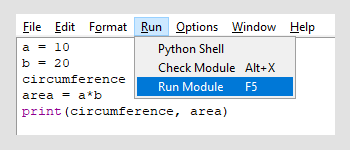

Programet Python
=================

Siç pamë në kapitullin për Karelin, programet përbëhen nga elemente. Le të shohim disa nga deklarimet themelore të Python që do të përdorim për të shkruar programet e para.

Caktimi i një vlere në një variabël
-------------------------------------

Variabël është një hapësirë e quajtur në kujtesën e një kompjuteri, në të cilin mund të ruajmë vlera të çfarëdo lloji (numri, teksti, vlera logjike ose diçka tjetër). Rezultatet e ndërmjetme shpesh vendosen në variabël gjatë llogaritjes. Kur drejtojmë një shell Python, ne mund të caktojmë një vlerë në një variabël me një komandë, dhe pastaj të përdorim vlerën e atij variabli në komandat e mëposhtme. Për shembull:

.. code::

    >>> base = 6*8
    >>> base
    48
    >>> base * 1.5
    72.0
    >>> base * 1.6
    76.80000000000001

.. infonote::
    
    *Deklarimi i vendosjes së vlerës **

Deklarimi i vendosjes së vlerës shkruhet duke shkruar emrin e një variabli, e ndjekur nga shenja e barabartë `` = ``, dhe pastaj shprehja vlerën e së cilës ia caktojmë variablës. Ne gjithashtu konsiderojmë numrat e plotë dhe numrat realë si shprehje (këto janë shprehjet më të thjeshta të mundshme).
    
.. infonote ::
    
    **Emrat e variablave **
    
    Emrat e ndryshueshëm (si dhe emrat e tjerë në programet që shkruajmë) mund të përbëhen nga shkronja të mëdha dhe të vogla, shifra dhe nënvizime, por ato nuk mund të fillojnë me një shifër.
    
    Python bën dallimin midis shkronjave të mëdha dhe të vogla. *N* dhe *n* janë emra të ndryshëm dhe nëse i përdorim të dy, ato do të përfaqësonin dy ndryshore të ndryshme.
    
    Emri i ndryshueshëm mund të jetë për aq kohë sa na duhet.
    
    Kur shkruajmë programe (ose deklarata individuale), ne përpiqemi t'u japim variablave emra kuptimplotë në mënyrë që komandat dhe programet të jenë sa më të qarta.

Në Python, është një stil i zakonshëm që shkronjat kapitale nuk përdoren (megjithëse lejohen), dhe kur një emër përbëhet nga më shumë se një fjalë, ato fjalë ndahen nga një underscore, për shembull, *price_of_one_piece*. Numrat përdoren në emra kur ka kuptim (i cili nuk është shpesh).

**Emrat e ndryshueshëm - kontrolloni mirë njohuritë tuaja:**

.. dragndrop:: console__basics_quiz_variable_names
    :feedback: Provo përsëri!
    :match_1: 2_date ||| gabim, fillon me karakter të gabuar
    :match_2: pet_no_2 ||| Emër i saktë
    :match_3: state_at_23:59 ||| Gabim, përmban karakter të gabuar

Match the proposed variable names with the answers.

.. mchoice:: console__basics_quiz_name
   :multiple_answers:
   :answer_a: vArIaBlE
   :answer_b: а1
   :answer_c: 2D_graphics
   :answer_d: _3D_graphics
   :answer_e: pet-no-2
   :Correct: a, b, d

   Cili nga këta mund të jetë emër variabli?

Printoni vlerat nga një program
---------------------------------

Në punën interaktive, mjafton të futemi në një shprehje për të parë vlerën e saj, por ne nuk mund ta përdorim atë në programe. Për të shtypur diçka nga një program, ne përdorim funksionin *print ()*. Tani për tani, ne do të përdorim vetëm formën më të thjeshtë të këtij funksioni.

Shprehja, vlera e së cilës duam të shtypim vihet midis kllapave, për shembull:

.. code::

    >>> print(2 + 2)
    4
    >>> 

Me një thirrje të vetme të funksionit *print ()* ne mund të shtypim vlera të shumta. Shprehjet, vlerat e të cilave ne duam të shtypim renditen në mes kllapave dhe ndahen me presje, për shembull:

.. code::

    >>> a = 10
    >>> b = 20
    >>> circumference  = 2*a + 2*b
    >>> area = a*b
    >>> print(circumference, area)
    60 200
    >>> 

.. infonote::

   Tashmë kemi hasur në funksionet në kapitujt mbi Karel, i njohim ato me kllapa pas emrit. Kujtojmë, ne i quajmë të dhënat që specifikojmë midis kllapave **parametrat** ose **argumentet**. Ne do të flasim së shpejti më shumë rreth funksioneve.
    

Fillimi i një programi
---------------------------

**Drejtimin e programeve në shfletuesin **

Për t'ju ndihmuar të filloni, ne përdorëm përbërësin **ActiveCode** të projektit `Runestone Interactive <http://runestoneinteractive.org/>` __ dhe ju mundësuam të drejtoni programet Python në faqet e internetit të këtij kursi. Për shembull, më poshtë janë deklaratat që kemi hyrë më parë në mënyrë interaktive, por kësaj radhe të shkruara si program. Ju mund ta filloni programin duke klikuar butonin "Run".

.. activecode:: console__program_first

    a = 10
    b = 20
    circumference  = 2*a + 2*b
    area = a*b
    print(circumference, area)
    
** Drejtimin e programeve nga mjedisi IDLE **

Rekomandohet që përveç shkrimit të programeve në këto faqe në internet, të drejtoni programe të paktën herë pas here në mjedisin *IDLE*. Të mësoheni me mjedisin *IDLE* është e rëndësishme që ju të bëheni më të pavarur në programim.

Kur ekzekutoni *IDLE* në kompjuterin tuaj, hapni redaktorin e tekstit të integruar (menuja File / New File) dhe shkruani programin e mëparshëm (ose ndonjë tjetër).

Kur mbaroni programin, ruajeni atë (menuja File / Save) dhe më pas ekzekutoni atë (menuja Run / Run Module).

Do ta shihni rezultatin në dritaren interaktive të shell.

**Drejtimi i programeve nga një mjedis në internet**

Një mënyrë tjetër për të drejtuar programin tuaj të Python është të përdorni një nga mjediset e programimit në internet. Një mjedis i tillë është https://repl.it/.

.. image:: ../../_images/Console/console_repl.it_start.png
  :width: 500px
  :align: center

Klikoni në butonin ``+ reja repl``, zgjidhni gjuhën e Python dhe klikoni ``Create repl``. Shfletuesi juaj i internetit do të hapë një faqe ku mund të shkruani një program dhe ta ekzekutoni atë.

.. image:: ../../_images/Console/console_repl.it_run.png
  :width: 500px
  :align: center

Gabimet e programit
------------------------

Ndonjëherë, mund të mos shkruani një deklaratë në program saktësisht siç kërkohet nga rregullat e Python. Në këtë rast, interpretuesi i Python nuk mund ta kuptojë deklaratën dhe ju merrni një mesazh gabimi. Çdo mjedis i ekzekutimit raporton një gabim në një mënyrë paksa të ndryshme, por secila prej tyre tregon se në cilën linjë të programit ka ndodhur gabimi dhe çfarë lloji i gabimit është.

Ndodhja e gabimeve (e njohur edhe si gabime) nuk duhet t'ju shqetësojë pasi është një gjë e zakonshme dhe ndodh me zhvilluesit me përvojë gjithashtu. Shikoni mesazhin me kujdes, sigurohuni që të kuptoni se çfarë është e gabuar, pastaj korrigjoni atë dhe drejtojeni programin përsëri. Të kuptuarit e mesazheve të gabimit është një pjesë integrale e programimit dhe mund të praktikohet si shumë aftësi të tjera.

Për t'ju ndihmuar të kuptoni mesazhet e gabimit që do të merrni (dhe të bëheni më pak të shqetësuar për gabimet), ju rekomandojmë që tani të përpiqeni të bëni me qëllim disa gabime të vogla që sidoqoftë mund t'ju ndodhin kur shkruani një program.

Kur bëni disa gabime të qëllimshme, do të fitoni përvojë se si duken mesazhet e gabimit dhe do të jetë më e lehtë për ju të kuptoni të njëjtat mesazhe më vonë, kur ato ndodhin pa qëllim.

Mund të provoni disa gabime këtu:

.. activecode:: console__program_make_err

    # add statement(s)
    

Ne kemi përgatitur gjithashtu disa programe me gabime, të cilat pastaj i shpjegojmë. Programet janë të shkurtër për të bërë gabime më të dukshme, por në programe më të gjata, korrigjimi i gabimeve është gati i njëjtë. Meqenëse mesazhi i gabimit përmban numrin e linjës së programit në të cilin ka ndodhur gabimi, në programe më të gjata duhet të gjeni së pari rreshtin e programit të përmendur dhe të shikoni atë (dhe ndoshta linjën e mëparshme).

Drejtoni secilin nga programet e mëposhtëm, pastaj shikoni mesazhin dhe shpjegimin e gabimit.

.. activecode:: console__program_err1

    prit(2+2)
    
Mesazhi thotë që është një gabim i tipit *NameError*. Kjo do të thotë që disa nga emrat në rreshtin e specifikuar janë të panjohur për interpretuesin e Python (emri nuk përcaktohet). Vini re se emri i funksionit *print* nuk është shkruar saktë (dhe funksioni *wait* nuk ekziston). Me futjen e shkronjës *n* gabimi korrigjohet dhe programi funksionon.

.. activecode:: console__program_err2

    result = 2 + 2
    print(resultt)
    
Gabimi është i të njëjtit lloj, vetëm këtë herë i referohet emrit *resultt*. Duke hequr shkronjën e tepërt *t*, programi bëhet i saktë.

.. activecode:: console__program_err3

    a = 3
    b = 2
    print(a b)
    
Gabimi është i tipit *SyntaxError*, që do të thotë se nuk respektohen rregullat e ndërtimit të deklaratës Python. Në këtë rast, një presje midis *a* dhe *b* mungon.

.. activecode:: console__program_err4

    a = 3
    b = 2
    print a, b

Një tjetër gabim sintaksor. Përsëri, rregullat e ndërtimit të deklaratave nuk u ndoqën, dhe këtë herë kllapat mungojnë.

.. activecode:: console__program_err5

    a = 3
    b = 0
    print(a / b)

Gabimi është i tipit *ZeroDivisionErrors*. Ky gabim është i ndryshëm nga ai i mëparshmi, sepse deklarata ishte shkruar në mënyrë korrekte dhe u interpretua me sukses. Sidoqoftë, ekzekutimi i kësaj komande rezultoi në ndarje zero, i cili nuk është një operacion i lejuar. Programi duhet të shkruhet në atë mënyrë që të mos tentojë një ndarje zero. Korrigjimi në këtë rast varet nga ajo që duam të bëjmë programi ynë në këtë situatë. Një mundësi është të kontrolloni që pjesëtuesi nuk është zero para se të ndahet.

~~~~

Sigurohuni t’i kuptoni këto tre lloje gabimesh duke iu përgjigjur pyetjes.

.. dragndrop:: console__program_quiz_errors
    :feedback: Provo përsëri!
    :match_1: SyntaxError|||print(3*(2+2)
    :match_2: NameError|||а=3 print(a / b)
    :match_3: ZeroDivisionError|||b=3//6 print(3 // b)

    Bashko llojin e gabimit me programin.
