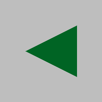

Vizatimi i linjave dhe poligoneve të drejta
-----------------------------------------------

Funksionet për vizatimin e linjave të drejta dhe poligoneve janë të ngjashme me funksionet për vizatimin e drejtkëndëshave, elipsave dhe rrathëve, të cilat ne kemi mësuar tashmë. Parametrat *canvas*, *color* dhe *thickness* përdoren gjithashtu këtu, me të njëjtin kuptim si më parë. Ne do t'i shpjegojmë parametrat e rinj ndërsa hasim në to.

Ne do ta përsërisim programin "bosh" këtu, i cili merret vetëm me bibliotekën PyGame dhe dritaren e vizatimit (dhe nuk vizaton asgjë nga vetja), në rast se dëshiron të provosh diçka shpejt.

.. activecode:: pygame__drawing_primirives_def_copy
    :nocodelens:
    :modaloutput: 
    :enablecopy:

    # -*- acsection: general-init -*-
    import pygame as pg, pygamebg
    canvas = pygamebg.open_window(200, 200, "Pygame")
    canvas.fill(pg.Color("gray"))
    # -*- acsection: main -*-

    # -*- acsection: after-main -*-
    pygamebg.wait_loop()
 

Vizatimi i një vize
''''''''''''''''''''''

Për të vizatuar një vizë përdoret funksioni ``pg.draw.line``, me ose pa parametrin e trashësisë. 

.. code::

    pg.draw.line(canvas, color, point1, point2, thickness)
    pg.draw.line(canvas, color, point1, point2)

- Parametrat *point1*, *point2* janë pika në ekran që paraqesin pikat fundore të segmentit të linjës. Përsëri, një pikë specifikohet si një tuple ose një listë me 2 elementë. Elementet e kësaj tuple ose liste janë koordinatat e pikës në dritaren në të cilën vizatojmë.
- Me këtë funksion, lëshimi i trashësisë ka një kuptim të ndryshëm sesa në funksionet e tjera, që është përdorimi i trashësisë së vijës së paracaktuar të 1 pikselit.
    
Për shembull, komanda:

.. activecode:: pygame__drawing_line_def
    :passivecode: true

    pg.draw.line(canvas, pg.Color("blue"), (20, 10), (40, 30), 2)
    
vizaton një vijë blu 2 pixel të gjerë nga pika :math:`(20, 10)` to point :math:`(40, 30)`.

.. image:: ../../_images/PyGame/drawing_line.png
   :width: 200px   
   :align: center 

Vizatimi i poligonit
'''''''''''''''''

Për të vizatuar poligonin përdorim funksionin ``pg.draw.polygon``, që ka 2 forma:

.. code::

    pg.draw.polygon(canvas, color, point_list, thickness)
    pg.draw.polygon(canvas, color, point_list)

- Parametri *point_list* paraqet një listë të vertikteve të poligonit që po vizatojmë. Për shembull [(50, 250), (150, 150), (250, 250)] është një listë me 3 pikë.
- Këtu përsëri, ne përdorim formën pa parametrin *thickness* kur duam që poligoni të mbushet me ngjyrën e specifikuar (nëse përcaktojmë një gjerësi, do të vizatohet një vijë poligonale e asaj gjerësi).

Për shembull, fjalia e mëposhtme vizaton një trekëndësh me ngjyrë :math:`(0, 100, 36)`. Kulmët e trekëndëshit janë: matematikë: `(50, 100)`,:math:`(150, 150)` dhe :math:`(150, 50)`.

.. activecode:: pygame__drawing_polygon_def
    :passivecode: true

    pg.draw.polygon(canvas, (0, 100, 36), [(50, 100), (150, 150), (150, 50)])

Përveç këtyre funksioneve të listuara dhe të përshkruara, ka edhe funksione të tjera vizatimi në modulin ``pg. pull``, por ne nuk do të merremi me to këtu. Nëse jeni të interesuar të mësoni më shumë rreth këtyre funksioneve, mund të gjeni informacion më të plotë për shembull në
 `<https://www.pygame.org/docs/ref/draw.html>`__

Funksionet e vizatimit - pyetje
'''''''''''''''''''''''''''''''''

Kontrolloni njohuritë:

.. parsonsprob:: pygame__drawing_quiz_arg_order
   
   Në çfarë radhe thirren këto argumente në funksionin `pg.draw.line` 
   -----
   canvas
   color
   first point coordinates
   second point coordinates
   thickness

.. mchoice:: pygame__drawing_quiz_polygon_args1
   :answer_a: pg.draw.polygon(canvas, color, [(0, 0), (50, 100), (100, 0)])
   :answer_b: pg.draw.polygon(canvas, color, (0, 0), (50, 100), (100, 0))
   :answer_c: pg.draw.polygon(canvas, color, (0, 0, 50, 100, 100, 0))
   :answer_d: pg.draw.polygon(canvas, color, [0, 0, 50, 100, 100, 0])
   :correct: a
   :feedback_a: Saktë
   :feedback_b: Provo përsëri
   :feedback_c: Provo përsëri
   :feedback_d: Provo përsëri

   Ne duam të vizatojmë një trekëndësh. Në çfarë forme mund të specifikohen koordinatat e pikave?

.. mchoice:: pygame__drawing_quiz_polygon_args2
   :multiple_answers:
   :answer_a: pg.draw.polygon(canvas, color, [(0, 0), (50, 100), (100, 0)], 7)
   :answer_b: pg.draw.polygon(canvas, color, [(0, 0), (0, 50), (50, 50), (50,  0)])
   :answer_c: pg.draw.polygon(canvas, color, [(0, 0), (50, 100), (100, 0)])
   :answer_d: pg.draw.polygon(canvas, color, [(0, 0), (0, 50), (50, 50), (50,  0)], 4)
   :correct: b, c
   :feedback_a: Saktë
   :feedback_b: Provo përsëri
   :feedback_c: Provo përsëri
   :feedback_d: Saktë

   Cila prej poligoneve të mëposhtëm nuk mund të tërhiqet me thirrje të shumëfishta të funksionit ``pg. pull.line``?
   
.. dragndrop:: pygame__drawing_quiz_function_names
    :feedback: Provo përsëri!
    :match_1: Line segment|||pg.draw.line
    :match_2: Polygon|||pg.draw.polygon
    :match_3: Rectangle|||pg.draw.rect
    :match_4: Circle|||pg.draw.circle

    Bashkoni fjalitë e vizatimit dhe format që ato vizatojnë.
    
.. parsonsprob:: pygame__drawing_quiz_general_arg_order

   Rendit sipas rendit tipik të argumenteve në funksionin e vizatimit:
   -----
   canvas
   color
   coordinates
   thickness

   
.. mchoice:: pygame__drawing_quiz_point_list
   :answer_a: Rreth
   :answer_b: Elips
   :answer_c: Poligon
   :answer_d: Segment vije
   :answer_e: Katror
   :correct: c
   :feedback_a: Provo përsëri
   :feedback_b: Provo përsëri
   :feedback_c: Saktë
   :feedback_d: Provo përsëri
   :feedback_e: Provo përsëri

  Kur vizatoni cila nga format e mëposhtme janë koordinatat e dhëna në formën e një liste të çifteve të renditura?

Vizatimi sipas instruksioneve
'''''''''''''''''''''''''''''''

.. questionnote::

    **Rrëmbyesi:** Vizatoni një frikë në një sfond të bardhë. Përbëhet nga pjesët e mëposhtme:
    
     - koka: një rreth i zi, 6 pixel i gjerë, i përqendruar në pikën (150, 70), me rreze 50
     - trup: një vijë e zezë e drejtë, 6 pixel e gjerë, nga pika (150, 120) deri në pikën (150, 300)
     - krahët: një vijë e zezë e drejtë, 6 pixel e gjerë, nga pika (80, 170) deri në pikën (220, 170)
     - këmbën e majtë: një vijë të zezë të drejtë, 6 pixel të gjerë, nga pika (150, 300) deri në pikën (90, 480)
     - këmbën e djathtë: një vijë e zezë e drejtë, 6 pixel e gjerë, nga pika (150, 300) deri në pikën (210, 480)

.. activecode:: pygame__drawing_scarecrow
   :nocodelens:
   :enablecopy:
   :modaloutput:
   :playtask:
   :includexsrc: src/PyGame/1_Drawing/1_BasicExamples/scarecrow.py
   
.. questionnote::

    **Pema:** Vizato një pemë në dërrasën e bardhë. Ka këto pjesë:
     - bagazhi: një drejtkëndësh i mbushur me ngjyra (97, 26, 9), madhësia 40 x 50, me kulm të majtë të sipërm në pikën (130, 250)
     - pjesa e sipërme: një trekëndësh i mbushur me ngjyra (0, 100, 36), me vertices (50, 250), (150, 150) dhe (250, 250)
     - pjesa e mesme e pemes: një trekëndësh i mbushur me ngjyra (0, 100, 36), me vertices (75, 200), (150, 100) и (225, 200)
     - pjesa e poshtme e pemes: një trekëndësh i mbushur me ngjyra (0, 100, 36), me vertices (100, 150), (150, 50) и (200, 150)
    
.. activecode:: pygame__drawing_tree
   :nocodelens:
   :enablecopy:
   :modaloutput:
   :playtask:
   :includexsrc: src/PyGame/1_Drawing/1_BasicExamples/tree.py

vizatimi surprizë
''''''''''''''''''

To see the drawing in the tasks that follow, you need to write the right statements and run your program.

.. questionnote::

    **surpriza 1 - lidh pikat:** Jepen vertikalet e një poligoni. Vizatoni atë shumëkëndësh të mbushur me ngjyrën "kaki" në një sfond "të errët".

.. activecode:: pygame__drawing_giraffe
   :nocodelens:
   :enablecopy:
   :modaloutput:
   :includexsrc: src/PyGame/1_Drawing/2_ByInstructions/giraffe.py

.. questionnote::

    **surpriza 2:** 
    
    Duke përdorur ngjyrën "jeshile", vizatoni:
    
     - Një elips i mbushur i gdhendur në një drejtkëndësh, kulmi i majtë i të cilit është në (75, 100), gjerësia e tij është 150, dhe lartësia e tij është 180;
     - Një rresht me gjerësi 6, nga pika (130, 110) deri në pikën (120, 20);
     - Një rresht tjetër i gjerësisë 6, nga pika (170, 110) deri në pikën (180, 20);
     - Një rreth i mbushur me rreze 10 pixel, i përqendruar në pikën (120, 20);
     - Një rreth i mbushur me rreze 10 pixel, i përqendruar në pikën (180, 20);
    
     Duke përdorur ngjyrën e zezë, vizatoni edhe dy elips të mbushur:

     - një i gdhendur në një drejtkëndësh, kulmi i sipërm i majtë i të cilit është në pikën (110, 140), gjerësia e tij është 30, dhe lartësia e tij është 50;
     - dhe një i gdhendur në një drejtkëndësh, kulmi i sipërm i majtë i të cilit është në pikën (160, 140), gjerësia e tij është 30, dhe lartësia e tij është 50;

.. activecode:: pygame__drawing_ant
   :nocodelens:
   :enablecopy:
   :modaloutput:
   :includexsrc: src/PyGame/1_Drawing/2_ByInstructions/insect.py
   
