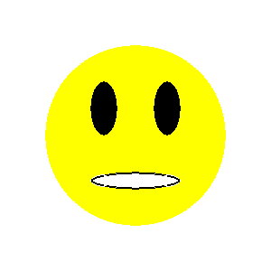

Vizatimi nga referenca
----------------------

Sapo kemi mësuar se si të vizatojmë disa forma themelore në mjedisin PyGame duke përdorur funksionet e vizatimit. Siç u përmend më parë, të gjitha imazhet e tilla përbëhen nga piksele. Këto janë të ashtuquajturat imazhe raster, ose bitmap. Ne kemi parë që, për të vizatuar forma themelore, duhet të dimë koordinatat e pikselave që përcaktojnë secilën formë të tillë. Sidoqoftë, në një situatë më realiste këto koordinata nuk jepen direkt dhe ne duhet t'i përcaktojmë vetë ato.

Nëse duam të gjenerojmë me programe një imazh duke përdorur një bitmap ekzistues si referencë, mund të përcaktojmë koordinatat e pikave nga imazhi i dhënë. Ne mund ta zmadhojmë figurën në një nga programet e shikimit të imazhit për të marrë çdo piksel të duket si një katror. Kjo mund të duket si kjo:

.. image:: ../../_images/PyGame/ladder_grid.png
   :width: 300px   
   :align: center 

Ne mund të shohim që kjo imazh u krijua duke vizatuar 4 linja horizontale dhe 2 vertikale, gjithashtu që të gjitha 6 linjat janë të zeza dhe të gjera 1 pixel. Meqenëse e dimë se koordinata *x* llogaritet nga e majta në të djathtë dhe *y* nga lart poshtë, si dhe që numërimi fillon nga zero, mund të përcaktojmë koordinatat e pikave fillestare dhe fundore të të gjashtë rreshtave thjesht duke numëruar .

Shkallë
''''''

Lexoni koordinatat nga imazhi i zmadhuar më lart dhe shkruani një program që vizaton shkallët si ato.

**Ndihmë:** duke numëruar (nga zero) mund të zbulojmë se koordinatat e pikave fundore të vijës vertikale të majtë janë (5, 3) dhe (5, 36). Koordinatat e pikave përfundimtare të 5 linjave të tjera do të përcaktohen në të njëjtën mënyrë.

.. activecode:: PyGame__drawing_ladder_assist
   :nocodelens:
   :enablecopy:
   :modaloutput:
   :includexsrc: src\PyGame\1_Drawing\3_ByGrid\ladder_small.py

   canvas.fill(pg.Color("white")) # paint background

   pg.draw.line(canvas, pg.Color("black"), ( 5, 3), ( 5, 36), 1)  # left side
   pg.draw.line(canvas, pg.Color("black"), (???, ???), (???, ???), 1)  # right side

   pg.draw.line(canvas, pg.Color("black"), (???, ???), (???, ???), 1) # step
   pg.draw.line(canvas, pg.Color("black"), (???, ???), (???, ???), 1) # step
   pg.draw.line(canvas, pg.Color("black"), (???, ???), (???, ???), 1) # step
   pg.draw.line(canvas, pg.Color("black"), (???, ???), (???, ???), 1) # step
   
Imazhi i madhësisë reale është shumë i vogël, vetëm 20 pixel i gjerë dhe 40 pixel i lartë. Ne gjithashtu mund të përcaktonim koordinatat e pikave për imazhe më të mëdha duke numëruar, por kjo do të ishte e lodhshme dhe e prirur ndaj gabimeve (kjo është arsyeja pse ne zgjodhëm një imazh kaq të vogël në këtë shembull). Lajmi i mirë është që programet e shikimit dhe redaktimit të figurave zakonisht tregojnë koordinatat e pikselit në të cilin aktualisht është kursori i mouse. Koordinatat e kursorit zakonisht shkruhen diku në shiritin e statusit në fund të dritares në të cilën po zhvillon programi, shpesh në këndin e poshtëm të majtë.

Për shembull, në programin e vizatimit *Paint*, kur një imazh zmadhohet 8 herë dhe shfaqet rrjeti që thekson piksele individuale, ne mund të pozicionojmë lehtësisht kursorin në çdo piksel dhe të lexojmë koordinatat e tij. Në këtë foto, kursori i mouse ishte në pikselin e kuq, i cili, siç thamë edhe më herët, ka koordinatat (5, 36).

.. image:: ../../_images/PyGame/read_xy.png
   :width: 600px   
   :align: center 

~~~~

Në detyrat e mëposhtme ju duhet të shkruani një program që vizaton një vizatim sa më të ngjashëm të jetë e mundur me atë të dhënë. Ju mund të shihni vizatimet që duhet të vizatoni kur klikoni në butonin "Luaj lojën".

Për t'ju ndihmuar të përcaktoni koordinatat e pikave të rëndësishme në një vizatim, programi që ju filloni duke klikuar butonin "Luaj lojën" do, krahas vizatimit, të tregojë koordinatat e pikës ku është kursori i mouse. Për ta bërë leximin më të lehtë, në të gjithë shembujt koordinatat e të gjitha pikave të rëndësishme janë të rrumbullakosura në 5 piksele (koordinatat përfundojnë me zero ose pesë).

Nëse doni të zgjidhni këto detyra jashtë shfletuesit të internetit, në mjedisin tuaj të programimit, mund të shkarkoni imazhet që programet tuaja duhet të vizatojnë, t'i hapni ato në një shikues imazhi dhe të lexoni koordinatat e pikave të rëndësishme atje.

.. image:: ../../_images/PyGame/drawing_grid_antenna.png
   :width: 120px
.. image:: ../../_images/PyGame/drawing_grid_balance.png
   :width: 120px                
.. image:: ../../_images/PyGame/drawing_grid_house.png
   :width: 120px                

.. image:: ../../_images/PyGame/drawing_grid_trees.png
   :width: 120px                

Antena
''''''

Para televizionit kabllor, sinjalet televizive merreshin nga antenat që zakonisht vendoseshin në çatitë e shtëpive dhe ndërtesave të njerëzve. Në këtë detyrë duhet të tërhiqet një antenë e tillë.

Siç mund ta shihni kur drejtoni shembullin, vizatimi përbëhet nga shtatë rreshta. Gjerësia e vijës vertikale është 4 piksele, dy kryesorët horizontale 1, dy të mesmet 2 dhe dy fundorët 3 piksele. Ngjyra e sfondit është "blueblue".

.. activecode:: PyGame__drawing_antenna_simple_assist
    :nocodelens:
    :enablecopy:
    :modaloutput:
    :playtask:
    :includexsrc: src\PyGame\1_Drawing\3_ByGrid\antenna_assist.py
   
    pg.draw.line(canvas, color???, (150, y1???,), (150, y2???,), 4)
    pg.draw.line(canvas, ???
    pg.draw.line(canvas, ???
    pg.draw.line(canvas, ???
    pg.draw.line(canvas, ???
    pg.draw.line(canvas, ???
    pg.draw.line(canvas, ???

.. reveal:: PyGame__drawing_antenna_simple_reveal
   :showtitle: Show solution
   :hidetitle: Hide solution

   Programi e plote mund ta provoni dhe këtu.
	       
   .. activecode:: PyGame__drawing_antenna_simple_solution
      :nocodelens:
      :enablecopy:
      :modaloutput:
      :includesrc: src\PyGame\1_Drawing\3_ByGrid\antenna.py
                   

Balance scale
'''''''''''''

Ky vizatim përbëhet nga një rresht (gjerësia e të cilit është 2) dhe tre trekëndësha. Trekëndëshi i mesëm, i cili paraqet mbështetjen e ekuilibrit, është i mbushur me ngjyra, kështu që kur vizatoni atë duhet të lihet parametri i gjerësisë, ndërsa për dy trekëndëshat e tjerë duhet të përcaktohet gjerësia 2.

.. activecode:: PyGame__drawing_balance
   :nocodelens:
   :enablecopy:
   :modaloutput:
   :playtask:
   :includexsrc: src\PyGame\1_Drawing\3_ByGrid\balance_assist.py
   
   canvas.fill(color???)) # paint background green
   pg.draw.line(canvas, color???, (x1???, y1???), (x2???,  y2???), 2) # beam
   
   # support
   pg.draw.polygon(canvas, pg.Color("brown"), [(???, ???), ...
   
   # left pan
   pg.draw.polygon(canvas, pg.Color("brown"), [(???, ???), ...
   
   # right pan
   pg.draw.polygon(canvas, pg.Color("brown"), [(???, ???), ...

.. commented out 

    .. reveal:: PyGame__drawing_balance_reveal
       :showtitle: Show solution
       :hidetitle: Hide solution

       The complete program is provided, you can try it here as well.
               
       .. activecode:: PyGame__drawing_balance_solution
          :nocodelens:
          :enablecopy:
          :modaloutput:
          :includesrc: src\PyGame\1_Drawing\3_ByGrid\balance.py

Smiley
''''''

Në këtë detyrë, puna që duhet të bëhet është pak më e ndërlikuar. Meqenëse vizatimi është i përbërë nga rrathë dhe elips, nuk mund të lexojmë me saktësi të gjitha koordinatat dhe matjet që na duhen drejtpërdrejt. Ajo që mund të bëjmë është të lexojmë për secilën elips: math: `x` të koordinatës së pikës së saj të majtë dhe të djathtë (( :math:` X_L` dhe :math:`X_R`), si dhe :math:`y`koordinata e pikës më të lartë dhe më të ulët (:math:`Y_T` dhe: matematikë: `Y_B`) Pas kësaj, gjerësia dhe lartësia e elipsit mund të llogariten si diferencat e përkatëse :math:` x` ( për gjerësi), dhe :math:`y` koordinatat (për lartësi).

Sa i përket rrethit, ne kemi mundësi të ndryshme:

- ne mund të vizatojmë rrethin si një elipse të gdhendur në një katror (duke përdorur funksionin *pg. pull.ellipse*)
- ne mund të përafrojmë koordinatat e qendrës së rrethit
- nëse duam të përcaktojmë koordinatat e qendrës së rrethit sa më saktë, duhet fillimisht të gjejmë pikat :math:`X_L`, :math:`X_R`, :math:`Y_T`, and :math:`Y_B` siç bëmë pçr elipsin, dhe pastaj llogarit koordinatat e qendrës me formulat :math:`X_c = {{X_R + X_L} \over 2}` dhe :math:`Y_c = {{Y_T + Y_B} \over 2}`

.. activecode:: PyGame__drawing_smiley
   :nocodelens:
   :enablecopy:
   :modaloutput:
   :playtask:
   :includexsrc: src\PyGame\1_Drawing\3_ByGrid\smiley_assist.py
   
   canvas.fill(color???) # paint background white
   pg.draw.circle(canvas, color???, (x???, y???), r???)           # head
   pg.draw.ellipse(canvas, color???, (x???, y???, w???, h???))    # left eye
   pg.draw.ellipse(canvas, ???, (???, ???, ???, ???))             # right eye
   pg.draw.ellipse(canvas, ???, (???, ???, ???, ???))             # mouth interior
   pg.draw.ellipse(canvas, ???, (???, ???, ???, ???), thickness?) # mouth edge
   
.. commented out

    .. reveal:: PyGame__drawing_smiley_reveal
       :showtitle: Show solution
       :hidetitle: Hide solution

       The complete program is provided, you can try it here as well.
               
       .. activecode:: PyGame__drawing_smiley_solution
          :nocodelens:
          :enablecopy:
          :modaloutput:
          :includesrc: src\PyGame\1_Drawing\3_ByGrid\smiley.py

Shtëpi
'''''

Vizatimi i një shtëpie përbëhet nga një drejtkëndësh kafe dhe një trekëndësh i kuq. Mund ta vizatojmë trekëndëshin si shumëkëndësh me tre vertikale. Dielli përshkruhet si një rreth portokalli dhe bari si një drejtkëndësh i gjelbër. Kini parasysh rendin e vizatimit për barin dhe diellin.

Është e mjaftueshme për të lexuar koordinatat e qendrës së rrethit që përfaqësojnë Diellin përafërsisht. Për ata që duan një sfidë të vogël matematikore, vini re se koordinatat e qendrës mund të përcaktohen më saktë të ngjashme me detyrën e mëparshme, megjithëse pika më e ulët nuk është e dukshme dhe koordinata :math:`Y_B` nuk mund të lexohet.

Nëse doni të shihni se si mund të përcaktoni koordinatat e qendrës me lexim dhe llogaritje më të saktë, klikoni në butonin "Përcaktimi i qendrës".

.. reveal:: PyGame__drawing_house_circle_center_reveal
   :showtitle: Determining the center
   :hidetitle: Hide determining the center

    Si në detyrën e mëparshme, lër :math:`X_L` dhe :math:`X_R` tregon koordinatat :math:`x` në pikën më të majtë dhe më të djathte të rrethit që përfaqëson Diellin dhe kooridnatat :math:`Y_T`, :math:`Y_B` :math:`y` më të larta dhe më të ulëta të atij rrethi. 
    
     Ne mund të pëcakrojmë koordinatat e qendrës :math:`x` siç bëmë në shembullin më përpara :math:`X_C = {{X_R + X_L} \over 2}`.
    
   Meqë pika më e ulët e rrethit nuk është e dukshme, ne nuk e lexojme dot vlerën :math:`Y_B`,por mund të përcaktojmë rrezen :math:`r` duke përdorur :math:`r = X_C - X_L` ose :math:`r = X_R - X_C`. Tani koordinata :math:`y` gjendet lehtesisht :math:`Y_C = Y_T + r`, kështu nuk kemi nevojë për :math:`Y_B`.
    
.. activecode:: PyGame__drawing_house
   :nocodelens:
   :enablecopy:
   :modaloutput:
   :playtask:
   :includexsrc: src\PyGame\1_Drawing\3_ByGrid\house2D_assist.py
   
   canvas.fill(color???) # paint background light gray
   ???
   ???
   pg.draw.rect(canvas, color???, (x???, y???, w???, h???)) # house
   pg.draw.polygon(canvas, color???, [(x1???, y1???), (x2???, y2???), (x3???, y3???)]) # roof

.. commented out

    .. reveal:: PyGame__drawing_house_reveal
       :showtitle: Show solution
       :hidetitle: Hide solution

       The complete program is provided, you can try it here as well.
               
       .. activecode:: PyGame__drawing_house_solution
          :nocodelens:
          :enablecopy:
          :modaloutput:
          :includesrc: src\PyGame\1_Drawing\3_ByGrid\house2D.py
   
Pemë
'''''

Tri pemë të njëjta duhen vizatuar, në mënyrë që secila pemë pasuese të merret duke lëvizur një të mëparshme në të djathtë. Natyrisht, kjo detyrë mund të ishte dhënë duke përshkruar thjesht pemën e parë dhe duke specifikuar distancën midis dy pemëve ngjitur. Programi që vizaton imazhin jepet megjithatë, sepse përdorimi i një imazhi për të specifikuar një detyrë është më i qartë dhe më i thjeshtë.

Për ta bërë detyrën pak më shumë si një situatë reale (në të cilën nuk ka imazh), në këtë shembull duke lexuar: matematikë: `x` koordinata është me aftësi të kufizuara qëllimisht për anën e djathtë të figurës. Të gjitha koordinatat e kërkuara që nuk mund t'i lexoni mund të llogariten.

.. activecode:: PyGame__drawing_trees
   :nocodelens:
   :enablecopy:
   :modaloutput:
   :playtask:
   :includexsrc: src\PyGame\1_Drawing\3_ByGrid\trees_assist.py
   
.. commented out

    .. reveal:: PyGame__drawing_trees_reveal
       :showtitle: Прикажи решење
       :hidetitle: Сакриј решење

       The complete program is provided, you can try it here as well.
               
       .. activecode:: PyGame__drawing_trees_solution
          :nocodelens:
          :enablecopy:
          :modaloutput:
          :includesrc: src\PyGame\1_Drawing\3_ByGrid\trees.py
