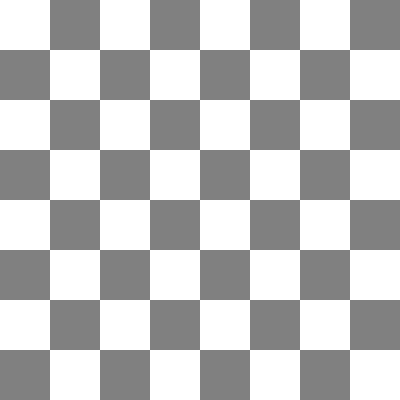

Paraqitni imazhe të gatshme
----------------------------

Vizatimi i formave themelore mund të jetë argëtuese dhe nganjëherë sfiduese. Sidoqoftë, do të ishte edhe më argëtuese të jesh në gjendje të ndërthurim vizatimin tonë me fotografi ose foto të gatshme. Në mjedisin PyGame kjo është shumë e thjeshtë. Le të shohim shembullin e mëposhtëm:

.. image:: ../../_images/tree.png
   :width: 50px

.. image:: ../../_images/apple_small.png
   :width: 50px

.. image:: ../../_images/basket.png
   :width: 50px

.. activecode:: PyGame__images_trees_and_apples1
   :nocodelens:
   :enablecopy:
   :modaloutput:
   :includesrc: src\PyGame\1_Drawing\9_UsingImages\trees_and_apples1.py

Ne kemi dy funksione të reja PyGame në këtë program:

- Funksioni :code:`pg.image.load` ngarkon imazhin nga disku. Ne kalojmë emrin e skedarit që përmban figurën në këtë funksion (rruga drejt skedarit mund të përfshihet), dhe si rezultat ajo kthen imazhin në një format të përshtatshëm për programin. Ne duhet ta ruajmë atë rezultat në disa variabla (në shembullin është variabli *tree_image*);

- Funksioni :code:`blit` shfaq një imazh në një dritare të caktuar. Argumentet e këtij funksioni janë një variabël që përmban figurën (rezultatin e funksionit *pg.image.load*) dhe pozicionin :math:`(x, y)` në dritaren ku duam të shfaqet imazhi. Në pozicionin që vendosëm, këndi i sipërm i majtë i figurës do të shfaqet. Në shembull, vendosëm pozicionin :math:`(0, 0)`, kështu që këndi i sipërm i majtë i figurës shfaqet në këndin e sipërm të majtë të dritares.

Provoni të shtypni vlera të ndryshme të koordinatave në vend të :math:`(0, 0)` për të kuptuar më mirë se si funksionon funksioni *blit*. Mund të vërejmë se shfaqja e pamjeve të gatshme është e ngjashme me shfaqjen e vizatimeve të luajtshme duke përdorur një anchor.

Ju gjithashtu mund të provoni të shfaqni një imazh në vende të shumta në ekran, siç kemi bërë me format themelore. Thjesht telefononi funksionin *blit* disa herë, me vlera të ndryshme për vendndodhjen e ekranit.

Kur shfaqni një imazh në vende të shumta, imazhet mund të mbivendosen. Prandaj, duhet pasur kujdes për rendin e shfaqjes. Në rastin tonë, së pari duhet të tregojmë pemën që imagjinojmë më tej, dhe pastaj pemën që imagjinojmë si më afër. Përndryshe skena përfundimtare mund të duket e gabuar, siç tregon fotografia e mëposhtme.

.. image:: ../../_images/PyGame/trees_and_apples_bad.png
   :width: 600px
   :align: center 
      
Objektet që ne i perceptojmë më tej janë zakonisht në pjesën e sipërme të figurës, që do të thotë se ata kanë një koordinatë më të vogël :math:`y`, megjithëse kjo jo gjithmonë mund të jetë e vërtetë. Në këtë dhe shembuj të ngjashëm do të jetë e mjaftueshme t'i përmbahemi këtij rregulli të thjeshtë: **është më mirë të shfaqim në fillim objektet me koordinatë më të vogël** :math:`y`.

Ushtrime
''''''''''''''''''

.. questionnote::

    **Ushtrim - mollë**

    Në programin vijues, korrigjoni renditjen e pozicioneve të pemëve në listë, dhe pastaj shtoni një thënie për të vizatuar një pemë në pozicion (*x*, *y*) në loop.

.. activecode:: PyGame__images_trees3
    :nocodelens:
    :enablecopy:
    :modaloutput:
    :playtask:
    :includexsrc: src\PyGame\1_Drawing\9_UsingImages\trees_and_apples3.py
    
    tree_image = pg.image.load("tree.png")  # image of a tree
    canvas.fill(pg.Color("darkgreen"))
    tree_pos = [(240, 290), (400, 200), (550, 170), (120, 150), (200, 70)]
    
    for x, y in tree_pos:
        pass # complete the program

.. questionnote::

    **Ushtrim - mollë**

    Përfundoni programin duke vizatuar pemën me mollët (si në shembull).

.. activecode:: PyGame__images_trees2
    :nocodelens:
    :enablecopy:
    :modaloutput:
    :playtask:
    :includexsrc: src\PyGame\1_Drawing\9_UsingImages\trees_and_apples2.py
    
    tree_image = pg.image.load("tree.png")  # image of a tree
    apple_image = pg.image.load("apple_small.png")  # image of an apple
    apple_positions = ((43,191), (61, 158), (124, 145), (134, 175), (160, 180))

    # complete: paint the background in dark green, draw a tree and apples on it
   

Pasi të mbaroni programin, mund të provoni gjithashtu të modifikoni programin për të shfaqur një pemë molle 100 piksele në të djathtë dhe 50 piksele më të ulët.
    
.. questionnote::

    **Ushtrim - Shah**

    Shkruani një program që vizaton një pozicion shahu, si në shembull. Emrat e kutive të zbrazëta të shahut, mbreti i bardhë, pelerina e bardhë dhe skedarët e imazheve të mbretit të zi janë përkatësisht "chess_table.png", "white_king.png", "white_rook.png", "black_king.png".
    

.. image:: ../../_images/white_king.png
   :width: 50px
    

   

.. activecode:: PyGame__images_chess_mate
    :nocodelens:
    :enablecopy:
    :modaloutput:
    :playtask:
    :includexsrc: src\PyGame\1_Drawing\9_UsingImages\chess_mate.py
    

.. questionnote::

    **Detyra - Pemishte**
    
     Në detyrën tjetër vizatimi i pemishteve ka filluar. Nëse e kuajmë programin, do të vërejmë disa mospërputhje. Një problem është se mollët gjenden vetëm në pemën e parë, dhe ato duhet të vendosen në secilën pemë, të rregulluara në të njëjtën mënyrë. Për më tepër, pema e dytë në të majtë mbivendoset, por nuk mbivendosen mollët e saj. Duhet të shfaqim pemën që tregojmë më herët së bashku me mollët e saj përpara se të kalojmë te pema tjetër.
    
Korrigjoni programin në mënyrë që të shfaq imazhin e marrë duke klikuar butonin "Luaj lojë".

.. activecode:: PyGame__images_trees_and_apples4
    :nocodelens:
    :enablecopy:
    :modaloutput:
    :playtask:
    :includexsrc: src\PyGame\1_Drawing\9_UsingImages\trees_and_apples4.py
   
    tree_image = pg.image.load("tree.png")  # image of a tree
    apple_image = pg.image.load("apple_small.png")  # image of an apple
    apple_positions = ((43,191), (61, 158), (124, 145), (134, 175), (160, 180))

    for tree_x, tree_y in ((0, 0), (200, 70), (120, 150), (240, 290), (550, 170), (400, 200)):
        canvas.blit(tree_image, (tree_x, tree_y))
        
    for apple_x, apple_y in apple_positions:
        canvas.blit(apple_image, (apple_x, apple_y))

