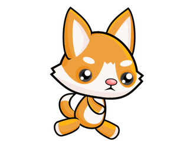
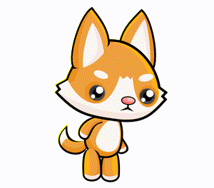

Animim
=========

Dihet që videot përbëhen nga një numër i madh i imazheve, të cilat shfaqen mjaft shpejt njëra pas tjetrës, me imazhe të njëpasnjëshme që ndryshojnë vetëm pak. Krijimi i videove në këtë mënyrë është në thelb i mundur sepse një person (qenie njerëzore), me një shpejtësi mjaft të lartë për të dhënë imazhe, nuk është në gjendje të shohë imazhe individuale, por përkundrazi ato përzihen së bashku dhe krijojnë përshtypjen e lëvizjes.

Krijimi i një përshtypje lëvizjeje me imazhe të qetë quhet animacion. Për shembull, nga tetë fotografitë e mëposhtme të një personazhi në pozicione të ndryshme:

.. image:: ../../_images/PyGame/pganim_running1.png
   :width: 120px
.. image:: ../../_images/PyGame/pganim_running2.png
   :width: 120px

.. image:: ../../_images/PyGame/pganim_running4.png
   :width: 120px
.. image:: ../../_images/PyGame/pganim_running5.png
   :width: 120px
.. image:: ../../_images/PyGame/pganim_running6.png
   :width: 120px
.. image:: ../../_images/PyGame/pganim_running7.png
   :width: 120px
.. image:: ../../_images/PyGame/pganim_running8.png
   :width: 120px

krijohet animacioni i mëposhtëm:
           

           
Secila prej pamjeve që shfaqen në një animacion quhet një *kornizë*. Programet për të cilët ne kemi punuar deri tani ishin duke vizatuar vetëm një vizatim (kornizë) dhe imazhi nuk u ndryshua pas kësaj. Në programet që përdorin animacion duhet të vizatohet një imazh për secilën kornizë. Në mësimet e mëposhtme do të shohim se si mund ta bëjmë atë.

   .. toctree::
      :maxdepth: 1

      ./03_PyGame_21_Animation_Basics.rst
      ./03_PyGame_22_Animation_Motion.rst
      ./03_PyGame_23_Animation_Stages.rst
      ./03_PyGame_24_Animation_Text.rst
      ./03_PyGame_25_Animation_Multiple.rst
