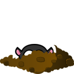

Animacion sipas fazave
-----------------------

Drita e trafikut
'''''''''''''''''

Një nga shembujt më të njohur të një pajisjeje që funksionon në shkallë është një semafor. Në shembullin e semaforit ne do të shpjegojmë duke punuar sipas fazave dhe si mund të animojmë ngjarjet që ndodhin në faza në një kompjuter.

Semafori mund të jetë në disa gjëndje. Për shembull, ai mund të shfaq dritën e kuqe, dritën e verdhë të ndezur, të fiket, etj. Ne do të thërrasim një periudhë gjatë së cilës semafori nuk e ndryshon gjendjen e tij në një fazë. Në funksionimin normal të semaforit, fazat alternative në mënyrë ciklike dhe secila fazë ka kohëzgjatjen e vet. Për shembull, merrni një semafor për të cilin alternojnë katër fazat e mëposhtme: 1 - drita e kuqe, 2 - drita e kuqe dhe e verdha, 3 - drita jeshile dhe 4 - drita e verdhë.

Për ta bërë animacionin më të thjeshtë, ne do të shprehim kohëzgjatjen e secilës fazë në numrin e kornizave (në vend të sekondave). Lejoni kohëzgjatjet e fazave të përmendura të jenë :math: `n_1`,:math:`n_2`, :math:`n_3` dhe :math:`n_4` përkatësisht. Atëherë i gjithë cikli i kornizave zgjat :math:`N = n_1 + n_2 + n_3 + n_4`. Nga këto korniza :math:`N`, e para :math:`n_1` i përkasin fazës së parë, tjetra :math:`n_2` në fazën e dytë etj.

Për të ditur në cilën fazë i përket kornizës aktuale, mund të prezantojmë një variabël global që do të numërojë kornizat. Meqenëse i gjithë cikli zgjat :math:`N`, mjafton të llogaritet sipas modulit :math:`N`. Kjo do të thotë që kur numëruesi i kornizës arrin vlerën :math: `N-1`, vlera tjetër është zero (llogarisim vetëm brenda një cikli). Në këtë rast, për vlerat nga 0 në :math:`n_1 - 1`, korniza i përket fazës së parë, për vlerat nga :math:`n_1` në: matematikë:`n_1 + n_2 - 1` deri në fazën e dytë, për vlerat nga :math:`n_1 + n_2` në :math:`n_1 + n_2 + n_3 - 1` në fazën e tretë, dhe për vlerat nga :math: `n_1 + n_2 + n_3` në :math:` N -1` në fazën e katërt.

    
Ja se si mund të duket një program i bazuar në këtë logjikë:

.. activecode:: PyGame__anim_stages_traffic_lights1
    :nocodelens:
    :modaloutput:
    :includesrc: src/PyGame/2_Animation/2c_Anim_Stages/TrafficLights1.py

Detyra
'''''''

.. questionnote::

    **Faza e Pestë:** Kopjoni programin e mëparshëm, pastaj vendosni një fazë për ndezjen e dritës jeshile, pas dritës jeshile dhe para dritës së verdhë (siç tregohet në shembull - butoni "Luaj detyrën").
    
**Këshillë:** Në fazën e pestë, ne nuk do të kemi një thirrje të vetme në funksionin *Draw_trafficlights*, por përkundrazi një kod që duket diçka si kjo:

.. code::

        if i_frame % 2 == 0:
            draw_trafficlights(...)
        else:
            draw_trafficlights(...)

.. activecode:: PyGame__anim_stages_traffic_lights1a
    :nocodelens:
    :modaloutput:
    :playtask:
    :includehsrc: src/PyGame/2_Animation/2c_Anim_Stages/TrafficLights1a.py

.. questionnote::

    **Avioni:** Shkruani një program që funksionon siç tregohet në shembullin (butoni "Luaj detyrën").
    
     Përshkrimi i lëvizjes: avioni fillon nga qendra e skajit të majtë të dritares. Së pari lëviz për 20 korniza 2 piksele drejt dhe lart, pastaj për 20 korniza 2 pixel drejt e poshtë. Kur del përmes skajit të djathtë të dritares, ai shfaqet në të njëjtën lartësi në skajin e majtë. Shkalla e kornizës është 50 korniza për sekondë.

.. image:: ../../_images/sun.png
   :width: 50px

.. activecode:: PyGame__anim_stages_plane
    :nocodelens:
    :modaloutput:
    :playtask:
    :includehsrc: src/PyGame/2_Animation/2c_Anim_Stages/airplane.py
    
    import pygame as pg, pygamebg
    (width, height) = (800, 350)
    canvas = pygamebg.open_window(width, height, "Plane")
    
    def new_frame():
        pass
    
    pygamebg.frame_loop(50, new_frame)

    sun_image = pg.image.load("sun.png")        # image of the sun
    plane_image = pg.image.load("airplane.png") # image of the plane
    plane_width = plane_image.get_width()       # plane image width
    plane_height = plane_image.get_height()     # plane image height

    # finish the program

.. questionnote::

    **Pyetje:** Shkruaj një program që funksionon siç tregohet në shembullin (butoni "Luaj detyrën").
    
     10 imazhe janë të ngarkuara me molin që del nga vrima pak më shumë në secilën imazh. Cikli ka katër faza që zgjasin gjithsej 28 korniza.
    
     - Skena një zgjat 10 korniza dhe gjatë kësaj faze moli po del nga vrima (imazhet tregohen në rregull, nga e para në të dhjetën).
     - Skena dy zgjat 5 korniza, gjatë së cilës moli është në pozitën më të lartë (tregohet imazhi i dhjetë).
     - Skena tre zgjat 10 korniza dhe gjatë kësaj faze moli po hyn në vrimë (pamjet tregohen nga e dhjeta në e parë).
     - Skena katër zgjat 3 korniza dhe gjatë saj moli është në vrimë (tregohet imazhi i parë).

.. image:: ../../_images/mole1.png
   :width: 50px
.. image:: ../../_images/mole2.png
   :width: 50px

.. image:: ../../_images/mole4.png
   :width: 50px

.. image:: ../../_images/mole6.png
   :width: 50px

.. image:: ../../_images/mole10.png
   :width: 50px

.. activecode:: PyGame__anim_stages_mole
    :nocodelens:
    :modaloutput:
    :playtask:
    :includehsrc: src/PyGame/2_Animation/2c_Anim_Stages/mole.py

    import pygame as pg, pygamebg
    (width, height) = (150, 150)
    canvas = pygamebg.open_window(width, height, "Mole")

    images = []   # list that will contain the images
    for i in range(1, 11): # reading images mole1.png, ..., mole10.png into the list
        image_name = "mole" + str(i) + ".png"  # building the image name from parts
        images.append(pg.image.load(image_name))

    brown = (60, 42, 3)
    Y_HORIZON = 125
    GROUND = (0, Y_HORIZON, width, height - Y_HORIZON) # part of the image under the horizon
    i_frame = 0 # frame counter
    i_image = 0

    def new_frame():
        # complete the function - calculate which image is displayed in this frame

        canvas.fill(pg.Color("skyblue"))     # paint background
        pg.draw.rect(canvas, brown, GROUND)  # paint rectangle GROUND to brown
        canvas.blit(images[i_image], (0, 0)) # display the image

    pygamebg.frame_loop(10, new_frame)
