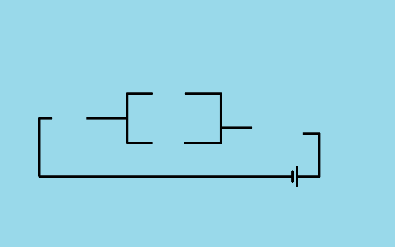

Ngjarjet e mouse
-----------------

Në shembullin "ndërprerës" kemi treguar se si mund të reagojmë në një program kur përdoruesi shtyp një buton të mouse. Edhe pse për përdoruesit një klik duket si një veprim i vetëm, kemi parë që për kompjuter është një sekuencë ngjarjesh që fillon me një ngjarje të tipit *pg.MOUSEBUTTONDOWN*.

Në shembujt dhe detyrat e mëposhtme, ne do të përdorim tre lloje të ngjarjeve të krijuara nga mouse:

- Shtypni çdo buton të mouse (si në shembullin me ndërprerës), në të cilin rast *event.type* ka një vlerë *pg.MOUSEBUTTONDOWN*
- Lëshimi i një butoni të mouse, në të cilin rast *event.type* ka një vlerë prej *pg.MOUSEBUTTONUP*
- Lëvizja e mouse, në këtë rast *event.type* ka një vlerë *pg.MOUSEMOTION*. Në fakt, kur lëvizni miun shumë ngjarje të tilla gjenerohen (secila prej tyre përshkruan një lëvizje të vogël të mouse në një interval kohor shumë të shkurtër, kështu që secila ngjarje e këtij lloji zakonisht përshkruan një lëvizje prej vetëm disa piksele).

Objektet e ngjarjes, lloji i të cilave është *pg.MOUSEBUTTONDOWN* gjithashtu përmbajnë disa informacione shtesë, siç janë:

- *event.pos*- pozicioni i mouse në kohën e regjistrimit të ngjarjes (përdorur tashmë në shembullin e ndërprerës)
- *event.button* - një numër nga 1 në 5 që tregon se cili buton i mouse shtypet (1 - majtas, 2 - i mesëm, 3 - djathtas, 4 - lëvizni lart, 5 - lëvizni poshtë)

Disa nga të dhënat shtesë të ngjarjeve të përfshira në *pg.MOUSEMOTION* objektet e ngjarjes janë:

- event.pos - pozicioni i mouse pas ngjarjes së lëvizjes së miut
- event.rel - një palë e porositur që përshkruan se sa ka ndryshuar pozicioni i mouse që nga ngjarja e mëparshme e lëvizjes së mouse
- event.buttons - një listë me tre elementë vlerash logjike, të cilat përcaktojnë për secilën nga tre butonat e mouse (0 - majtas, 1 - të mesëm, 2 - djathtas) nëse është shtypur gjatë lëvizjes së mouse.

Klikoni në përpunim - ushtrime
''''''''''''''''''''''''''''''''

Ndoshta nuk keni vërejtur që në programin "switch" nga mësimi i kaluar, drita mund të ndizet dhe fiket duke klikuar ndonjë buton të mouse. Kjo për shkak se i njëjti lloj ngjarje gjenerohet për secilën buton të miut, dhe ne nuk kemi kontrolluar se cili buton është shtypur kur ndodhi ngjarja.

.. questionnote::

    **Detyrë - butoni i majtë si ndërprerës:**
    
     Kopjoni programin "kaloni" këtu, pastaj modifikoni atë në mënyrë që drita të ndizet dhe fiket vetëm me butonin e majtë të mouse.

**Ndihmë:** Përdor të dhënat e *event.button*.

.. activecode:: PyGame__interact_switch_left_button
    :nocodelens:
    :enablecopy:
    :playtask:
    :modaloutput:
    :includehsrc: src/PyGame/3_Interaction/3d_Mouse_events/Switch_left_button.py

.. questionnote::

    **Detyrë - tre ndërprerës:**
    
     Përdorni pjesë të programit "kaloni" dhe krijoni një program që simulon punën e tre çelësave, siç tregohet në shembull.

.. image:: ../../_images/Shema3_Off.png
   :width: 50px

.. image:: ../../_images/SwitchOff.png
   :width: 50px
.. image:: ../../_images/SwitchOn.png
   :width: 50px
.. image:: ../../_images/BulbOff.png
   :width: 50px
.. image:: ../../_images/BulbOn.png
   :width: 50px

.. activecode:: PyGame__interact_switches
    :nocodelens:
    :enablecopy:
    :playtask:
    :modaloutput:
    :includehsrc: src/PyGame/3_Interaction/3d_Mouse_events/Switches.py

    import pygame as pg, pygamebg
    (width, height) = (800, 500)
    canvas = pygamebg.open_window(width, height, "Switches")

    schema_images = (pg.image.load('Shema3_Off.png'), pg.image.load('Shema3_On.png'))
    switch_images = (pg.image.load('SwitchOff.png'), pg.image.load('SwitchOn.png'))
    bulb_images = (pg.image.load('BulbOff.png'), pg.image.load('BulbOn.png'))

    switch_on = [False, False, False]
    switch_pos = [(100, 200), (300, 150), (300, 250)]
    bulb_pos = (500, 100)
    
    # finish the program

Evente të tjera të mouse
'''''''''''''''''''''''''

Siç u përmend në fillim të këtij mësimi, një program mund t'i përgjigjet gjithashtu lëshimit të butonit të miut dhe ngjarjeve të lëvizjes së mouse. Për ta bërë këtë, është e nevojshme të krahasoni vlerën e *event.type* me konstantet *pg.MOUSEBUTTONUP* dhe *pg.MOUSEMOTION*. Më poshtë janë detyrat ku mund ta provoni.

.. questionnote::

    **Detyra - linjat e vizatimit:**
    
     Përfundoni programin në mënyrë që të mund të vizatojë vija të drejta, si në shembull.

.. activecode:: PyGame__interact_mouse_lines1
    :nocodelens:
    :enablecopy:
    :playtask:
    :modaloutput:
    :includehsrc: src/PyGame/3_Interaction/3d_Mouse_events/mouse_lines1.py

    import pygame as pg, pygamebg
    (width, height) = (400, 400)
    canvas = pygamebg.open_window(400, 400, "Lines with mouse")

    mosue_pos = (0, 0)
    line_start = mosue_pos
    line_is_being_drawn = False
    previous_lines = []

    def new_frame():
        canvas.fill(pg.Color("white")) # paint canvas
        if line_is_being_drawn:
            pg.draw.line(canvas, pg.Color('black'), line_start, mosue_pos)

        for a, b in previous_lines:
            pg.draw.line(canvas, pg.Color('black'), a, b)

    def handle_event(event):
        global line_is_being_drawn, line_start, mosue_pos

        
        # add statements here that work as follows:
        
        # if the event type is "mouse button down":
        #     the line drawing mode is switched on
        #     we start the line at the current position of the mouse
        # otherwise, if the event type is "mouse button going up":
        #     the line drawing mode is switched off
        #     the new line is from the memorized start of the line to the current position of the mouse
        #     add a new line to the list of previous lines
        # otherwise, if the event type is "moving mouse":
        #     in the mouse_pos variable, remember the current position of the mouse

    pygamebg.frame_loop(30, new_frame, handle_event)

.. questionnote::

    **Detyrë - vizatime vijash me fshirje:**

     Kopjoni programin për vizatimin e linjave më poshtë, pastaj shtoni një mundësi për të fshirë të gjitha rreshtat me një klik të djathtë.

**Këshillë:** Për të bërë dallimin midis butonave të mouse të majtë dhe të djathtë në program, të dhënat *event.button* duhet të përdoren përsëri. Kodi në funksionin *hand_event* tani duhet të duket si kjo:

.. activecode:: PyGame__interact_mouse_lines2_part
    :passivecode: true

        if the event type is "mouse button going down":
            if button 1 (left button) is pressed
                the line drawing mode is switched on
                the new line is from the memorized start of the line to the current position of the mouse
            if button 3 (right button) is pressed
                empty the list of previous lines
        otherwise, if the event type is "releasing mouse button":
            if button 1 (left button) is pressed
                the line drawing mode is switched off
                the new line is from the memorized start of the line to the current position of the mouse
                add a new line to the list of previous lines
        otherwise, if the event type is "move mouse":
            remember the current position of the mouse in the mouse_pos variable 

.. activecode:: PyGame__interact_mouse_lines2
    :nocodelens:
    :enablecopy:
    :playtask:
    :modaloutput:
    :includehsrc: src/PyGame/3_Interaction/3d_Mouse_events/mouse_lines2.py

.. questionnote::

    **Detyrë - tërheqje:**
    
     Programi i mëposhtëm tregon se si të lejojë përdoruesit e programit të tërheqë objektet.
    
     Provoni programin (tërhiqni mollët në shportë) dhe përpiquni ta kuptoni atë, pastaj përgjigjuni pyetjeve më poshtë.

.. image:: ../../_images/apple.png
   :width: 50px
.. image:: ../../_images/basket.png
   :width: 50px
.. image:: ../../_images/drag_scene.png
   :width: 50px

.. activecode:: PyGame__interact_drag
    :nocodelens:
    :enablecopy:
    :modaloutput:
    :includesrc: src/PyGame/3_Interaction/3d_Mouse_events/drag.py

.. mchoice:: pygame__interact_quiz_drag1
   :answer_a: indeksi i mollëve që po vizatojmë
   :answer_b: indeksi i mollëve që po tërheqim
   :answer_c: numri total i mollëve
   :answer_d: numri i mollëve të mbetura në pemë
   :correct: b
   :feedback_a: Provo përsëri
   :feedback_b: Saktë
   :feedback_c: Provo përsëri
   :feedback_d: Provo përsëri

   Çfarë ështl variabli *i_apple* në program? 

.. dragndrop:: pygame__interact_quiz_drag2
    :feedback: Provo përsëri!
    :match_1: if mouse_is_on_image(event.pos, basket_pos, basket_image):|||nëse molla duhet fshirë
    :match_2: if mouse_is_on_image(event.pos, apple_positions[i]|||nëse perdoruesi mori mollën
    :match_3: if len(apple_positions) == 0:|||nëse loja ka mbaruar
    :match_4: if i_apple >= 0:|||nëse tërheqja vazhdon

    Lidh fjalët me kuptimin.

.. mchoice:: pygame__interact_quiz_drag3
   :answer_a: ne lexojmë nëse butoni i mouse është joaktiv gjatë lëvizjes 
   :answer_b: tërheqja është tip tjetër eventi
   :answer_c: kur lëvizim mouse, indeksi i  "mollës që po tërheqim" është -1
   :correct: c
   :feedback_a: kjo nuk është një mënyrë e përshtatshme, pasi butoni mund të shtypet në një hapësirë të zbrazët (përdoruesi nuk e "mori" objektin që duhet të tërhiqet)
   :feedback_b: Jo, nuk ka kështu tip eventi
   :feedback_c: Saktë

   Si e bëjmë dallimin midis tërheqjes dhe lëvizjes së thjeshtë të mouse në një program?
